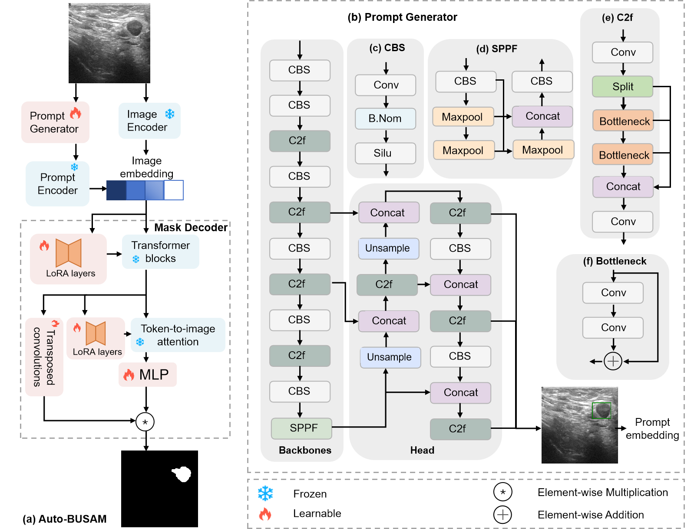

# Auto-BUSAM
This repository contains the implementation of the following paper:
> **Auto-BUSAM: Automatic Prompting for Breast Ultrasound Segmentation using SAM** 

## Overview
  
 Our method incorporates a learnable Prompt Generator module, which automatically generates bounding box prompts that guide SAM's focus to relevant regions within ultrasound images, minimizing the reliance on expert knowledge and reducing manual effort.  To further enhance SAM's segmentation capabilities,  a Low-Rank Adaptation (LoRA) module is specifically introduced to address challenges such as low contrast, variable tumor shapes, and blurred boundaries by filtering out noise and focusing on critical image features. Auto-BUSAM consistently outperforms leading segmentation models, which underscores Auto-BUSAM's potential to advance automated breast ultrasound image segmentation. 

## Train
Coming soon

## Dataset

We use two datasets for training and evaluation:
[BUSI](https://scholar.cu.edu.eg/?q=afahmy/pages/dataset) &
[Dataset B](https://helward.mmu.ac.uk/STAFF/m.yap/dataset.php)

## Compare with other methods
  

## Acknowledgement
We appreciate the developers of [Segment Anything Model](https://github.com/facebookresearch/segment-anything) and [YOLO](https://github.com/ultralytics/ultralytics). The code of Auto-BUSAM is built upon [BLO-SAM](https://github.com/importZL/BLO-SAM/tree/master?tab=readme-ov-file) and [SAM LoRA](https://github.com/JamesQFreeman/Sam_LoRA), and we express our gratitude to these awesome projects.
